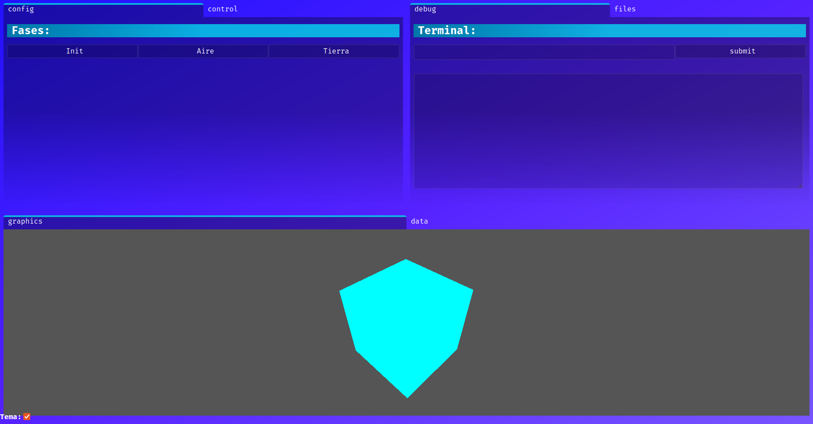

# App prototype Cansat 2024

The first app prototype for igualadasats cansat in 2024.

## How to use

On Bash: `chmod +x compile.sh` and `./compile.sh` or `node server.js`. On Bach: `node server.js` or make a .bat yourserf, silly windows user :)

It is a web aplication which conects the visual interface with a server using express. The server is able to interconect a database and a raspberry pi. In this way, our aplication can control the satelit and save the data recived.
